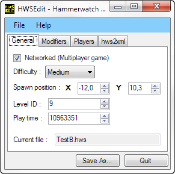
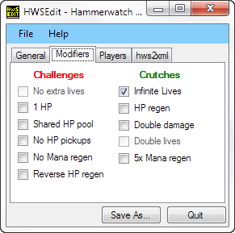
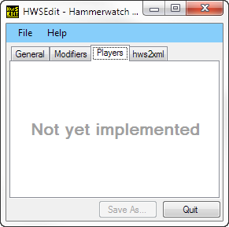
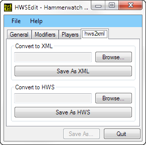

HWSEdit
=======
  
Hammerwatch Save Editor  
  

  
By Joe DF & Drew Burden  
  
Fugue Icons - (C) 2012 Yusuke Kamiyamane  
A grand thanks to [Myran](http://hammerwatch.com/forum/index.php?action=profile;u=1), for the C# class (the core of this application)  
  
Released under the [MIT License](http://opensource.org/licenses/MIT)
  
http://hammerwatch.com/forum/index.php?topic=2197.0